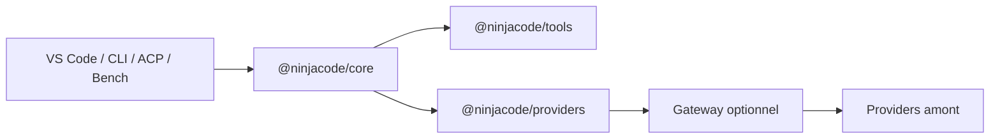
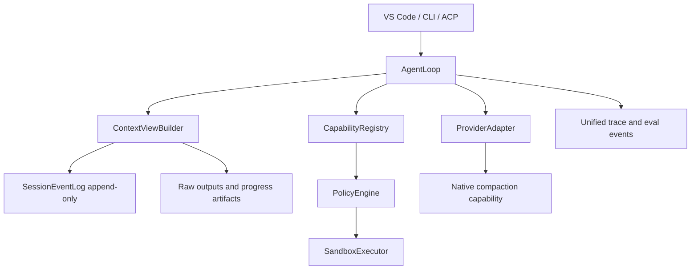

# Audit complet de l’agent NinjaCode

Date de référence : 15 août 2026  
Périmètre : harness local, contexte, outils, VS Code, CLI, ACP, providers, MCP, gateway et auto-router.  
Nature : audit d’architecture, de fiabilité, de sécurité et d’évaluation. Aucun correctif produit n’est inclus.

## Verdict

NinjaCode possède une bonne fondation d’ingénierie, mais il ne peut pas encore prétendre au niveau de Cursor, Claude Code ou Codex sur les tâches longues et l’exécution autonome.

Ses meilleurs atouts sont réels :

- boucle agentique centralisée dans `@ninjacode/core` ;
- permissions déterministes, indépendantes du prompt ;
- outils et providers découplés ;
- sessions, reprise, shadow-git, budget et arrêt des boucles ;
- préfixe pensé pour le prompt cache ;
- 923 tests agent passants et 14/14 scénarios déterministes NinjaBench ;
- architecture ouverte, multi-provider et multi-surface.

Les principaux obstacles sont également structurels :

1. un grant shell par type de commande peut être contourné avec `bash -c` ;
2. le shell, les hooks et MCP héritent de l’environnement hôte sans sandbox OS ;
3. la compaction dite « LLM » résume une pré-compression déjà très lossy ;
4. les sorties masquées ne restent pas récupérables et certaines ne sont pas idempotentes ;
5. le client MCP est resté sur la génération 2024 du protocole ;
6. les règles scoped sont injectées globalement ;
7. les benchmarks ne mesurent pas encore la variance, l’IDE réel ou les références publiques actuelles.

Maturité estimée, sur la seule base des preuves de cet audit :

- architecture interne : 8/10 ;
- fiabilité déterministe : 8/10 ;
- gestion de contexte longue durée : 5/10 ;
- sécurité d’exécution autonome : 4/10 ;
- évaluation comparative : 6/10 ;
- observabilité production : 4/10 ;
- ouverture et extensibilité : 8/10.

## Architecture actuelle

### Flux principal

Le point d’entrée public est `packages/core/src/agent.ts`. `Agent.run()` :

1. prépare un checkpoint par requête ;
2. charge hooks, skills, règles et plan ;
3. fige les outils selon le mode et le format d’édition ;
4. boucle dans `agentRunLoop.ts` et `agentTurn.ts` ;
5. compacte l’historique avant l’appel modèle ;
6. diffuse le streaming ;
7. passe les tool calls dans `ToolPipeline` ;
8. persiste session, traces et résultats ;
9. vérifie la terminaison, le budget et les boucles.

Les dépendances suivent une direction saine :



Le gateway ne porte pas la mémoire agent. Il authentifie, route, proxyfie, mesure et facture. Cette séparation est simple et doit être conservée.

### Forces à préserver

- `PermissionEngine` évalue le risque et la cible de chaque appel.
- Le risque shell peut monter à `destructive` via `riskFor`.
- Les appels destructifs exacts ne sont pas couverts par un grant grossier.
- `resolveInWorkspace` suit les symlinks et rejette les sorties de workspace.
- Les chaînes assistant `tool_calls` / résultats sont normalisées.
- La boucle possède `maxTurns`, budget, abort, circuit breaker et détection de répétition.
- Les outils sont filtrés une fois par session, ce qui stabilise le cache.
- Les skills ne placent que leur index dans le prompt système.
- Les snapshots scratchpad/plan sont ajoutés à l’historique et non au prompt système.
- Les sessions et checkpoints donnent déjà une base de reprise solide.

### Complexité accidentelle

La classe `Agent` reste compréhensible, mais son câblage est réparti entre de nombreux fichiers `agent*.ts`. Cette fragmentation n’est pas encore un bug, mais elle ralentit l’audit et rend les invariants implicites.

La cible ne doit pas être un nouveau framework. Elle doit réduire le cœur à cinq responsabilités :

- `AgentLoop` : transitions et terminaison ;
- `ContextViewBuilder` : vue compacte dérivée d’un historique brut ;
- `CapabilityRegistry` : outils visibles et chargement dynamique ;
- `PolicyEngine` : risque, approbation et sandbox ;
- `SessionEventLog` : source de vérité append-only.

## Constats prioritaires

### NC-SEC-01 — Contournement d’un grant shell par interpréteur

Sévérité : critique  
Confiance : élevée  
Fichiers : `packages/tools/src/shellDanger.ts`, `packages/tools/src/shellScope.ts`, `packages/tools/src/shell.ts`, `packages/core/src/permissions.ts`

La classification reconnaît directement `rm -rf`, `git push --force` et plusieurs familles dangereuses. Elle ne descend pas dans les charges de `bash -c`, `sh -c`, `node -e`, `python -c` ou `eval`.

Preuve exécutée sans lancer la charge :

```text
commandShape: bash -c <destructive payload>
danger: null
risk: shell
scopes: ["bash"]
needsApproval: false
reason: session grant (command type)
```

Après « toujours autoriser bash », une charge destructive encapsulée peut donc passer sans nouvelle approbation.

Action minimale :

- supprimer les grants par programme pour les interpréteurs et wrappers ;
- ne mémoriser que la commande canonique exacte tant qu’il n’existe pas de sandbox ;
- classer `*-c`, `eval`, `xargs`, scripts distants et commandes dynamiques comme non-grantables ;
- ajouter des tests adversariaux de non-régression.

Critère d’acceptation : aucune transformation syntaxique d’une charge destructive connue ne doit réutiliser un grant antérieur.

### NC-SEC-02 — Shell hôte non isolé

Sévérité : critique pour le mode autonome, élevée sinon  
Confiance : élevée  
Fichiers : `packages/tools/src/shell.ts`, `packages/core/src/hooks.ts`, `packages/core/src/mcpClient.ts`

`run_shell` exécute le shell utilisateur et transmet `process.env`. Les hooks font de même. MCP stdio hérite de l’environnement complet.

Conséquences :

- lecture hors workspace ;
- accès réseau libre ;
- exposition des secrets présents dans l’environnement ;
- impact sur les services locaux et le système ;
- combinaison dangereuse entre contenu non fiable, données privées et canal d’exfiltration.

Les approbations ne remplacent pas une frontière d’exécution. Cursor rapporte en 2026 qu’un sandbox réduit aussi la friction : 40 % d’arrêts en moins sur les runs sandboxés.

Action minimale :

- environnement filtré par défaut ;
- réseau deny-by-default avec escalade explicite ;
- macOS Seatbelt, Linux Landlock/seccomp, Windows via WSL2 ;
- erreurs structurées indiquant exactement la règle de sandbox bloquante ;
- aucun accès aux fichiers ignorés ou sensibles sans permission dédiée.

### NC-CTX-01 — Le résumé LLM ne voit pas l’historique complet

Sévérité : élevée  
Confiance : élevée  
Fichier : `packages/core/src/context.ts`

`summarizeWithLlm()` appelle d’abord `summarizeMessagesHeuristic()`. Le modèle de résumé ne reçoit donc que :

- les 40 dernières lignes ;
- 200 caractères par message user ;
- 150 caractères par message assistant ;
- 100 caractères par résultat outil.

Une sonde de 90 messages a confirmé :

```text
summaryCalls: 1
heuristicLines: 40
containsEarlyTail: false
containsLateTail: false
```

Le modèle ne peut pas préserver une information qui lui a déjà été retirée. Le commentaire « high-fidelity » ne correspond donc pas au comportement.

Autre défaut : l’usage et le coût de cet appel de résumé ne sont pas transmis à `BudgetTracker`.

Action minimale :

- donner au compresseur l’historique compactable réel, dans sa limite ;
- tracer tokens, coût, durée et modèle du compresseur ;
- utiliser la compaction native du provider lorsque disponible ;
- garder une stratégie lisible locale pour les providers qui ne la proposent pas.

### NC-CTX-02 — Masquage irréversible et message contradictoire

Sévérité : élevée  
Confiance : élevée  
Fichier : `packages/core/src/observationMasking.ts`

Le stub indique « Do not re-read this; the content is already in the conversation ». C’est faux : le contenu brut a été remplacé.

De plus, la liste « re-runnable » inclut :

- `run_shell`, qui peut être non idempotent ;
- `fetch_url` et `web_search`, dont la réponse peut changer ;
- des logs ou résultats temporels impossibles à reproduire.

Action minimale :

- stocker les sorties longues dans des fichiers immuables de session ;
- remplacer le body par une référence, une empreinte et un aperçu ;
- permettre `grep`/pagination dans l’archive ;
- ne jamais classer shell ou réseau comme récupérable sans preuve d’idempotence.

Cette approche est proche de la découverte dynamique publiée par Cursor : les longues sorties, terminaux et historiques deviennent des fichiers consultables à la demande.

### NC-CTX-03 — Accumulation des résumés et contraintes épinglées

Sévérité : élevée sur longues sessions  
Confiance : élevée  
Fichier : `packages/core/src/context.ts`

Chaque résumé antérieur reste épinglé. Une nouvelle compaction en ajoute un second. Les résumés ne sont jamais consolidés.

Toute phrase user contenant `must not`, `do not`, `never`, `required` ou `constraint` est également épinglée. Comme les messages `[System]` internes utilisent le rôle user, ils peuvent être épinglés accidentellement.

Risques :

- croissance sans borne ;
- règles obsolètes ou contradictoires ;
- thrashing près du seuil ;
- perte du bénéfice du cache.

Action minimale :

- un seul état compacté canonique ;
- contraintes structurées avec identifiant et statut ;
- historique brut conservé hors contexte ;
- hystérésis après compaction ;
- test de 5 à 10 cycles successifs.

### NC-CTX-04 — Seuils incomplets

Sévérité : moyenne à élevée  
Confiance : élevée  
Fichiers : `packages/core/src/compactionGate.ts`, `packages/core/src/contextEstimate.ts`

Les seuils token sont 85 % et 95 %, mais ils ne réservent pas `maxTokens`. Une entrée à 85 % plus 8 192 tokens de sortie peut dépasser la fenêtre.

Le seuil message « soft » est pratiquement mort : `shouldSkipCompaction()` résume seulement après le hard limit ou sous pression token.

L’estimation `chars/4` ignore :

- les tokens réels par tokenizer/modèle ;
- les images et autres `parts` multimodaux ;
- le formatage provider ;
- le budget de sortie.

Action minimale :

- calculer `inputBudget = contextWindow - reservedOutput - safetyMargin` ;
- calibrer l’estimation sur `usage.inputTokens` réel ;
- supprimer les seuils et triggers inutilisés ;
- déclencher selon la pression et la phase de tâche, pas uniquement le nombre de messages.

### NC-MCP-01 — Client MCP obsolète et risque uniforme

Sévérité : élevée  
Confiance : élevée  
Fichier : `packages/core/src/mcpClient.ts`

Le client annonce `protocolVersion: "2024-11-05"`, fait encore le handshake `initialize/initialized` et ne suit pas le core stateless 2026-07-28.

Tous les outils MCP deviennent `risk: "network"` :

- un outil de lecture et un outil destructif ont la même politique ;
- en mode autonome, ils sont auto-approuvés ;
- les annotations MCP ne sont pas exposées ;
- la provenance et le niveau de confiance du serveur ne sont pas intégrés ;
- les réponses HTTP/SSE peuvent grossir en mémoire avant troncature ;
- MCP stdio hérite de l’environnement hôte.

Les annotations MCP doivent rester des hints, jamais des garanties. La politique doit croiser serveur de confiance, capability, arguments et état de session.

Action minimale :

- adopter le SDK MCP officiel et la version 2026-07-28 ;
- supporter le core stateless, les headers de routage et les catalogues cacheables ;
- charger dynamiquement les schémas des outils réellement nécessaires ;
- borner les réponses à la lecture, pas après coup ;
- dériver une politique pessimiste quand les annotations sont absentes ou non fiables.

### NC-NET-01 — SSRF dans `fetch_url`

Sévérité : élevée  
Confiance : élevée  
Fichier : `packages/tools/src/interactive.ts`

Le tool valide uniquement `http:`/`https:` et suit les redirects. Il ne bloque pas :

- loopback ;
- adresses privées ;
- metadata cloud ;
- résolution DNS rebondissante ;
- redirects vers une destination interdite.

Action minimale : résolution DNS et validation à chaque redirect, allowlist configurable, blocage des plages privées/link-local/metadata par défaut.

### NC-RULE-01 — Règles scoped injectées globalement

Sévérité : moyenne  
Confiance : élevée  
Fichier : `packages/core/src/rules.ts`

Les règles `.cursor/rules` et Copilot avec `globs` sont toutes injectées dans le prompt système. Les règles `alwaysApply: false` sans glob sont également incluses avec une simple note « manual ».

Conséquences :

- bruit permanent ;
- contradictions entre langages ou sous-projets ;
- coût et invalidation du cache ;
- comportement dépendant de la capacité du modèle à respecter une annotation non exécutable.

Action minimale :

- garder uniquement les règles globales dans le système ;
- indexer les règles scoped par nom, description et glob ;
- charger leur body lorsque les fichiers touchés le justifient ;
- traiter les règles manuelles comme réellement opt-in.

### NC-SUB-01 — Hypothèse de bypass sous-agent non confirmée

Sévérité actuelle : faible, risque latent moyen  
Confiance : élevée  
Fichiers : `packages/core/src/subagents.ts`, `skills.ts`, `customAgents.ts`

L’hypothèse initiale était que `delegate`, `use_skill` et les handoffs, tous déclarés `read_only`, pouvaient lancer un enfant en écriture.

Le code complet ne confirme pas ce bypass aujourd’hui :

- `delegate` n’expose que `research`, `planner` et `verifier` ;
- `custom` est mappé sur le mode `ask` ;
- `forMode()` filtre les outils avant l’allowlist ;
- l’allowlist ne peut donc que réduire le registre déjà read-only.

En revanche, `runSubAgent()` crée toujours une politique `autonomous` et allowliste tous les outils filtrés. Le rôle exporté `fast_edit` utiliserait le mode agent et pourrait donc auto-approuver des tools shell non destructifs. Aucun appel direct n’a été trouvé.

Action minimale : l’enfant doit hériter d’une politique bornée par le parent ; supprimer le couple implicite `autonomous + allowlist`.

### NC-REL-01 — Timeout produit désactivé

Sévérité : moyenne  
Confiance : élevée  
Fichiers : `packages/core/src/agentOptions.ts`, `apps/vscode/src/chat/agentRunner.ts`

`runTimeoutMs` vaut `0` par défaut et l’extension ne le configure pas. Les autres gardes réduisent le risque, mais un run peut durer jusqu’à épuisement des tours ou du budget.

Le runner benchmark utilise `Promise.race()` sans appeler `agent.abort()` au timeout. L’agent sous-jacent peut continuer après le verdict et après le nettoyage du workspace temporaire.

Action minimale :

- timeout produit explicite et configurable ;
- abort réel dans le bench ;
- test qu’aucune activité outil ne survit au timeout.

### NC-BUILD-01 — Le build modifie les sources

Sévérité : élevée pour la reproductibilité  
Confiance : élevée  
Fichiers : `apps/vscode/package.json`, `apps/vscode/scripts/bump-version.mjs`, `package.json`

`pnpm build` a exécuté un `prebuild` qui a changé la version de `0.2.40` à `0.2.41` dans deux manifestes. Les valeurs ont été remises à l’état initial après la validation.

Un build doit être pur et idempotent.

Action minimale :

- déplacer le bump dans une commande release explicite ;
- faire échouer la CI si `build` ou `test` modifie l’arbre source ;
- enregistrer SHA, version de harness, prompt et modèle dans chaque rapport.

### NC-EVAL-01 — Évaluation forte localement, faible comparabilité externe

Sévérité : élevée pour l’objectif « numéro 1 »  
Confiance : élevée  
Fichiers : `apps/bench`, `.github/workflows`, `apps/bench/PLAN.md`

Points forts :

- graders déterministes ;
- métriques tokens, cache, coût, tours, tools et diff ;
- suite mock rapide ;
- pipeline SWE-bench déjà amorcé.

Lacunes :

- pas d’E2E VS Code host/webview/agent ;
- ACP presque non testé en scénario complet ;
- pas de couverture mesurée ;
- `bench:quick` par défaut à un seul essai ;
- pas de Terminal-Bench 2.1 ni ProgramBench ;
- pas de scores publics reproductibles ;
- pas de mesure de keep rate ;
- pas d’OpenTelemetry agent ;
- l’ancien eval CLI existe encore.

## Validation exécutée

Environnement :

- Node `v24.19.0` ;
- pnpm `9.15.9`.

Résultats agent :

- build : passe, mais mutait les versions ;
- typecheck : passe, 10 tâches Turbo ;
- lint : 0 erreur, 18 warnings ;
- dependency-cruiser : 594 modules et 2 037 dépendances, aucune violation ;
- knip : échoue avec 1 import non résolu, 9 exports inutilisés et 12 types exportés inutilisés ;
- tests : 923/923 passent hors sandbox ;
- NinjaBench harness : 14/14.

Résultats gateway :

- build ciblé `@ninjacode/backend` : passe ;
- tests : 383 passent, 2 tests d’intégration sont skipped ;
- build monorepo complet : exit 137 pendant les builds Angular parallèles ; les deux packages TypeScript critiques avaient compilé.

La première exécution des tests agent sous sandbox a échoué parce que les tests créent des dépôts Git temporaires hors workspace. La relance hors sandbox passe. Ce comportement confirme que le protocole de test doit déclarer explicitement ses besoins d’isolation.

Le bundle webview produit pèse environ 4,25 MB minifié, 1,19 MB gzip, avec un warning Vite de chunk supérieur à 500 KB.

## Canary live

Une campagne live fraîche, présente dans `runs/quick/run-2026-08-15T08-18-41.json`, a été analysée :

- modèle : `deepseek-v4-flash` ;
- 21 tâches ;
- 21 réussites ;
- un seul essai par tâche ;
- coût total estimé : 0,045544 USD ;
- médiane : 11,6 secondes ;
- 123 318 tokens input comptabilisés ;
- 60 250 tokens output ;
- 814 976 tokens cache read ;
- part cache read : 86,9 % des tokens input + cache read ;
- 6,3 tours moyens ;
- 189 tool calls ;
- 4 erreurs outil ;
- maximum : 19 tours.

Ce résultat est encourageant mais ne mesure ni pass@k, ni pass^k, ni variance. Il n’est pas comparable à Cursor ou Claude Code :

- corpus synthétique et relativement court ;
- une partie des graders accepte une réponse exacte sans évaluer la qualité générale ;
- aucun concurrent au même modèle ;
- aucune trajectoire IDE ;
- une tâche mentionne une fixture manquante mais passe malgré tout ;
- le rapport référence le commit `ca9803d`, alors que la copie auditée ne contient pas les métadonnées `.git`.

Aucune clé live n’était disponible dans le processus d’audit pour relancer trois essais. Le rapport existant a donc été utilisé sans exposer ni réutiliser de secret.

## État de l’art 2026 et écarts NinjaCode

### Cursor

Cursor pousse la découverte dynamique :

- longues sorties écrites dans des fichiers ;
- historique brut consultable après résumé ;
- terminaux représentés comme fichiers ;
- outils MCP chargés à la demande.

Cursor publie une réduction de 46,9 % des tokens sur les runs utilisant MCP avec ce chargement dynamique.

NinjaCode a déjà le bon pattern pour les skills, mais pas encore pour les règles, MCP, terminaux ou historique compacté.

Cursor a également déployé un sandbox multi-OS et rapporte 40 % d’arrêts en moins, ce qui invalide l’opposition « sécurité ou fluidité ».

### OpenAI Codex

Codex s’appuie sur la Responses API et une compaction native. Le résultat contient un item opaque qui porte l’état latent du modèle. C’est performant mais provider-specific et peu auditable.

NinjaCode doit exposer une capability de compaction provider :

- native quand le provider la supporte ;
- locale, lisible et récupérable sinon ;
- même contrat de télémétrie pour les deux.

### Anthropic

Anthropic combine :

- compaction ;
- notes structurées hors contexte ;
- travail incrémental ;
- artefacts de handoff ;
- vérification E2E ;
- sous-agents à contexte séparé.

NinjaCode a scratchpad, plan, checkpoints et sous-agents. Il lui manque surtout un état de progression structuré, vérifié et durable pour les runs qui traversent plusieurs fenêtres.

### Recherche contexte 2026

ACON optimise les règles de compression à partir de paires de trajectoires où le contexte complet réussit et le contexte compressé échoue. Les auteurs rapportent 26–54 % de réduction de pic token tout en préservant largement la performance.

CompactionRL montre que la politique de compaction peut améliorer les scores de coding agents, mais suppose un entraînement. NinjaCode ne doit pas commencer par du RL. Il doit d’abord instrumenter ses pertes, constituer des paires de trajectoires et optimiser des règles simples mesurées.

ACE propose une idée particulièrement adaptée à un produit ouvert : garder le brut et choisir dynamiquement entre vue brute, abstraction ou drop. Cela évite que chaque décision de compression soit irréversible.

### Benchmarks 2026

SWE-bench Verified reste utile, mais son signal se tasse. Le site officiel met désormais aussi en avant Multilingual, Multimodal, CodeClash et ProgramBench.

Terminal-Bench 2.1 corrige 28 des 89 tâches. Au 15 août 2026, la page consultée affiche notamment :

- Claude Code / Claude 5 Fable : 83,8 % ± 1,2 ;
- Codex CLI / GPT-5.5 : 83,1 % ± 1,1 ;
- Cursor CLI / Grok 4.5 : 79,3 % ± 1,5.

ProgramBench contient 200 tâches de reconstruction de logiciels complets à partir du binaire et de la documentation. Il mesure mieux la construction from-scratch que SWE-bench.

NinjaCode doit publier au minimum Terminal-Bench 2.1, un canary ProgramBench et un benchmark qualité/érosion du code. Optimiser uniquement SWE-bench serait une erreur.

## Architecture cible simple



Principes :

- le transcript brut n’est jamais détruit ;
- la vue modèle est dérivée, compacte et remplaçable ;
- chaque outil a un risque par appel et une provenance ;
- le sandbox porte la garantie, le prompt explique seulement son fonctionnement ;
- les capacités provider sont explicites ;
- toutes les décisions importantes émettent un événement mesurable ;
- les règles et outils lourds sont découverts à la demande ;
- aucun comportement critique ne dépend d’une regex de prompt.

## Feuille de route

### Dans les 48 heures

P0 — fermer le contournement shell :

- désactiver les grants par programme pour interpréteurs/wrappers ;
- ajouter une matrice de charges adversariales ;
- filtrer l’environnement shell/hooks/MCP ;
- forcer une approbation par commande exacte sans sandbox.

P0 — réparer la compaction :

- donner au résumeur le contexte réel ;
- comptabiliser son coût ;
- remplacer le stub trompeur ;
- réserver le budget de sortie ;
- empêcher l’accumulation illimitée des résumés.

P0 — rendre le build pur :

- supprimer le bump du `prebuild` ;
- ajouter un gate « arbre inchangé après build/test » ;
- corriger ou exclure proprement les fixtures de `knip`.

### Dans les 2 semaines

P1 — exécution sûre :

- interface `SandboxExecutor` ;
- backend macOS en premier, puis Linux ;
- réseau bloqué par défaut ;
- denylist fichiers sensibles et secrets ;
- erreurs sandbox compréhensibles par le modèle.

P1 — contexte v2 :

- archive brute par session ;
- références paginables pour sorties, terminaux et historique ;
- un résumé canonique ;
- hystérésis ;
- estimation calibrée sur usage réel ;
- eval pleine vue contre vue compactée.

P1 — MCP moderne :

- SDK officiel ;
- spec 2026-07-28 ;
- tool catalog dynamique ;
- annotations comme hints ;
- politique par serveur et capability ;
- bornes de réponse et OAuth correct.

P1 — règles :

- règles globales dans le système ;
- règles scoped chargées dynamiquement ;
- règles manuelles réellement manuelles.

### Dans les 6 semaines

P2 — qualité mesurée :

- `bench:quick --trials 3` par défaut en live ;
- pass@k, pass^k, intervalle et baseline ;
- E2E VS Code mock ;
- smoke ACP JSON-RPC ;
- Terminal-Bench 2.1 ;
- canary ProgramBench ;
- score public versionné.

P2 — observabilité :

- OpenTelemetry opt-in ;
- spans run/turn/model/tool/compaction/sandbox ;
- taxonomie unique d’erreurs ;
- TTFE, cache hit, context loss, keep rate et coût ;
- rapport par modèle et version de harness.

P2 — simplification :

- unifier les constantes de contexte ;
- supprimer les exports morts ;
- réduire les adapters eval dupliqués ;
- faire hériter explicitement la politique des sous-agents.

### Dans les 3 mois

P3 — différenciation :

- séparation « cerveau / mains / session » ;
- workers locaux isolés et, optionnellement, distants ;
- agents parallèles sur worktrees avec ownership explicite ;
- vérificateur indépendant limité aux preuves ;
- apprentissage des règles de compaction à partir des échecs réels ;
- benchmark privé renouvelé à partir de sessions opt-in ;
- publication transparente des scores, coûts et versions.

## Critères de succès

Sécurité :

- zéro bypass dans la suite shell adversariale ;
- aucun secret hôte visible sans permission ;
- réseau et filesystem réellement confinés ;
- MCP destructif jamais auto-approuvé par défaut.

Contexte :

- aucune perte silencieuse : chaque donnée supprimée du prompt reste référencée ;
- pas de compaction sur deux tours consécutifs hors force explicite ;
- coût du compresseur inclus dans le budget ;
- baisse mesurée des tokens sans baisse significative du pass rate ;
- récupération exacte d’un fait antérieur après plusieurs compactions.

Qualité :

- 100 % harness déterministe ;
- quick pass@3 et pass^3 publiés ;
- E2E IDE vert ;
- Terminal-Bench 2.1 et ProgramBench canary versionnés ;
- aucune régression cachée derrière un changement de modèle.

Simplicité :

- moins d’invariants implicites ;
- aucune étape de build mutante ;
- un contrat unique pour risques, sorties et traces ;
- suppression nette de code avant ajout d’abstractions.

## Sources externes principales

- Cursor, « Dynamic context discovery » : https://cursor.com/blog/dynamic-context-discovery
- Cursor, « Implementing a secure sandbox for local agents » : https://cursor.com/blog/agent-sandboxing
- Cursor, « Best practices for coding with agents » : https://cursor.com/blog/agent-best-practices
- OpenAI, « Compaction » : https://developers.openai.com/api/docs/guides/compaction
- OpenAI, « Unrolling the Codex agent loop » : https://openai.com/index/unrolling-the-codex-agent-loop/
- Anthropic, « Effective harnesses for long-running agents » : https://www.anthropic.com/engineering/effective-harnesses-for-long-running-agents
- Anthropic, « Effective context engineering for AI agents » : https://www.anthropic.com/engineering/effective-context-engineering-for-ai-agents
- MCP, spécification 2026-07-28 : https://blog.modelcontextprotocol.io/posts/2026-07-28/
- MCP, annotations de risque : https://blog.modelcontextprotocol.io/posts/2026-03-16-tool-annotations/
- Microsoft Research, ACON, ICML 2026 : https://www.microsoft.com/en-us/research/publication/acon-optimizing-context-compression-for-long-horizon-llm-agents/
- CompactionRL : https://arxiv.org/abs/2607.05378
- ACE : https://arxiv.org/abs/2606.31564
- SWE-bench : https://www.swebench.com/
- Terminal-Bench 2.1 : https://snorkel.ai/leaderboard/terminal-bench-2-1/
- ProgramBench : https://programbench.com/

## Conclusion

NinjaCode n’a pas besoin d’empiler davantage de heuristiques. Il doit d’abord rendre trois couches incontestables :

1. une exécution réellement isolée ;
2. un contexte compact mais récupérable ;
3. une évaluation publique et reproductible du couple harness + modèle.

La base actuelle permet d’y arriver sans réécriture. Les gains les plus importants viendront de la suppression des comportements implicites, de la conservation du brut hors contexte et de politiques exécutables plutôt que de prompts plus longs.
